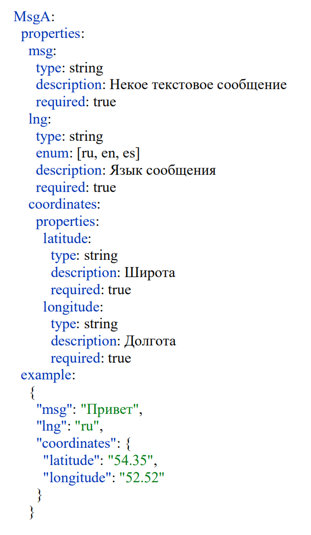
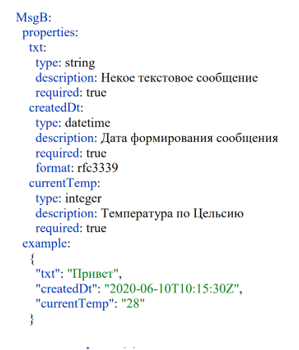

# Hawking Bros

## Задача

Разработать микросервис-адаптер для преобразования данных. Сценарий работы:

1. Получаем данные от сервиса А
2. Запрашиваем данные с сервиса погоды (Гисметео) используя полученные координаты
3. Формируем ответ из данных сервиса A и сервиса погоды
4. Отправляем данные сервису B

Обрабатываем ситуации когда:
1. В запросе поле lng != "ru"
2. В запросе поле msg - это пустая строка
3. Сервис погоды недоступен

Также учитываем что:
1. Сервисов с погодой может стать больше
2. lng - это enum ["ru", "en", "es"]

Входные данные в RAML:  


Выходные данные в RAML:  


## Результат

**Технологии**: Spring Boot, Swagger, Lombok

**Сборка**: Запустите ```mvn package``` в директории проекта

**REST API**: Перейдите по ссылке ```http://localhost:8080/swagger-ui/index.html``` чтобы ознакомиться с документацией OpenAPI и протестировать API через Swagger

[Документация](doc/OpenAPI_docs.txt) также доступна в формате OpenAPI. 


