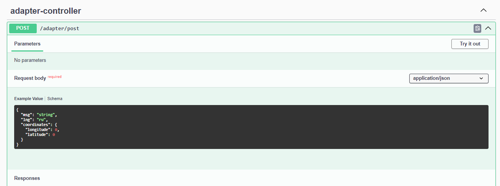

# Hawking Bros

## Задача

Разработать микросервис-адаптер для преобразования данных. Сценарий работы:

1. Получаем данные (см. структуру ниже)
2. Запрашиваем данные с сервиса погоды используя полученные координаты
3. Дополняем первые данные вторыми
4. Отправляем данные дальше 

## Результат

**Технологии**: Spring Boot, Swagger, Lombok

**Сборка**: Запустите ```mvn package``` в директории проекта

**REST API**: Перейдите по ссылке ```http://localhost:8080/swagger-ui/index.html``` чтобы ознакомиться с документацией OpenAPI и протестировать API через Swagger 



