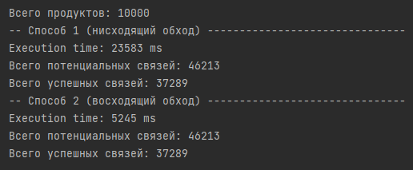

# Nomia

## Задание:

## А теперь подробнее:

### Термины:

- **Продукт**: Элемент системы, который может быть частью смеси.
- **Смесь**: Продукт, который имеет набор составных ингридиентов. 

Каждая смесь может служить ингридиентом для другой смеси, либо же для нескольких продуктов.  
Это значит что мы имеем отношение "многие ко многим", и связи между продуктами нельзя представить в виде иерархии уникальных элементов.  
Многие листья могут повторяться, это следует учесть при обходе дерева.

### А теперь на языке графов:

Каждый продукт представляет собой узел направленного графа, а связи между продуктами - его ребра.  

Для решения задачи нужно предотвратить появление в графе циклических зависимостей.  
Для этого достаточно перед добавлением продукта A в продукт B проверить, существует ли между ними маршрут.  
Чтобы проверить наличие маршрута A->B (или B->A) лучше всего использовать алгоритм поиска элемента X в узле Y.

## Подходы к решению:

Для поиска можно использовать два подхода к обходу графа:

1. **Обход сверху вниз**: Начинается с корневого узла (продукта) и движется вниз по дереву, проверяя каждый узел на наличие циклических зависимостей.  
Ссылка на класс: [Product (1)](src/main/java/approach1/Product.java)
2. **Обход снизу вверх**: Начинается с листового узла (продукта) и движется вверх по дереву, также проверяя каждый узел на наличие циклических зависимостей.   
Ссылка на класс: [Product (2)](src/main/java/approach2/Product.java)  

В обоих случаях будем использовать алгоритм DFS (обход в глубину),
поскольку при движении в обоих направлениях порядок связей будет образовывать дерево.

  

Из картинки видно, что листьев (ингридиентов) либо больше, либо они чаще повторяются, из-за чего второй способ должен работать эффективнее.
Чтобы дополнительно повысить эффективность поиска следует предотвратить повторное сканирование уже посещенных узлов.
## Результаты:
Для проверки работы алгоритма были сгенерированы 10_000 продуктов, каждый из которых может служить ингридиентом для N смесей.
Кол-во смесей, а также идентификатор каждой смеси определяется случайным образом. 

Здесь продукт может быть добавлен в одну из смесей от 0 до 5 раз:  

Здесь продукт может быть добавлен в одну из смесей от 0 до 10 раз:  

В этих изображениях видно, что система корректно обрабатывает данные о продуктах и их смесях, обеспечивая целостность и корректность структуры смесей.  

Также очевидно что второй подход работает намного быстрее.  

Не смотря на то что и там и там используется алгоритм DFS
(и казалось бы сложность алгоритма должна быть сопоставимой), понимание природы данных позволяет использовать алгоритм более эффективно.
